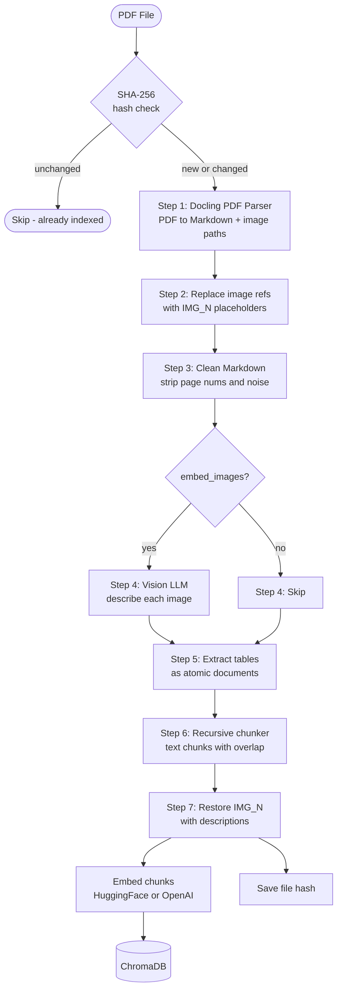
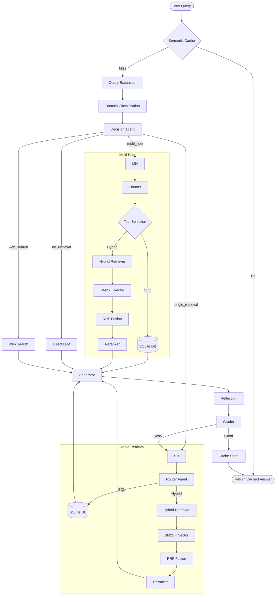

# Agentic RAG

Domain-aware, multi-strategy Agentic RAG built with **LangGraph + LangChain**.  
Switch LLM, embeddings, or chunking strategy entirely in `config.yaml` — no code changes.

---

## Tech Stack

| Layer | Library / Tool |
|---|---|
| Orchestration | LangGraph (StateGraph), LangChain |
| LLM | Groq `llama-3.3-70b-versatile` / `llama-3.1-8b-instant` |
| Embeddings | HuggingFace `all-MiniLM-L6-v2` (or OpenAI) |
| Vector Store | ChromaDB (local persistent) |
| Sparse Retrieval | BM25 (rank-bm25) |
| Fusion | Reciprocal Rank Fusion (RRF) |
| Reranker | Cohere Rerank v3 (optional, `COHERE_API_KEY`) |
| SQL | SQLite + Plan-Execute SQL Agent |
| Web Search | Tavily API (`TAVILY_API_KEY`) |
| Semantic Cache | FAISS (local, cosine similarity) |
| Deduplication | SHA-256 file hash store |
| PDF Parsing | Docling |
| Backend API | FastAPI + Uvicorn |
| Frontend UI | Streamlit |

---

## Project Structure

```
Agentic_rag/
├── api.py                   FastAPI backend (query / index / health)
├── main.py                  Entry-point script
├── config.yaml              Single config file (all provider switches)
├── requirements.txt         Backend + pipeline dependencies
│
├── frontend/
│   ├── app.py               Streamlit ChatGPT-like UI (no business logic)
│   └── requirements.txt     Frontend-only deps (streamlit, requests)
│
├── src/
│   ├── config.py            YAML → Config dataclass
│   ├── embeddings.py        Embedding adapter (HuggingFace / OpenAI)
│   ├── llm.py               LLM adapter (Groq / VertexAI)
│   ├── vectorstore.py       Chroma adapter
│   ├── indexer.py           index_file() / index_folder() facade
│   │
│   ├── indexing/
│   │   ├── pipeline.py        Full 7-step indexing pipeline
│   │   ├── pdf_parser.py      Docling PDF → Markdown
│   │   ├── image_enricher.py  Image → vision LLM text
│   │   └── chunker.py         Markdown recursive + table-aware chunking
│   │
│   ├── agents/
│   │   ├── prompt_manager.py  All prompts (single source of truth)
│   │   ├── domain_agent.py    hr_domain / research_domain / general
│   │   ├── decision_agent.py  no_retrieval / single / multi_hop / web_search
│   │   ├── router_agent.py    sql vs hybrid source selection
│   │   ├── generator_agent.py Answer + numbered inline citations
│   │   ├── reflection_agent.py grounded / complete / coherent check
│   │   └── grader_agent.py    Score 1-5 + corrective query rewrite
│   │
│   ├── retrieval/
│   │   ├── hybrid.py          BM25 + dense RRF + optional Cohere rerank
│   │   ├── vector_retriever.py  Dense Chroma retriever
│   │   ├── bm25_retriever.py    BM25 sparse retriever
│   │   └── sql_agent.py         Plan-Execute SQL agent (SQLite HR DB)
│   │
│   ├── graph/
│   │   ├── state.py           AgentState TypedDict
│   │   └── workflow.py        LangGraph StateGraph wiring
│   │
│   ├── cache/
│   │   └── semantic_cache.py  FAISS semantic cache (lookup + store)
│   │
│   └── utils/
│       ├── logger.py          JSON structured logger + file handler
│       └── custom_exception.py  Typed exceptions (file/line/traceback)
│
└── experiments/
    ├── test_all.py            Master runner — 11 component tests
    └── test_*.py              Individual agent/node test files
```

---

## Indexing Pipeline



---

## Retrieval and Agentic RAG Pipeline


---

## Quick Start

```powershell
# 1. Create virtualenv
python -m venv .venv
.\.venv\Scripts\Activate.ps1

# 2. Install backend dependencies
pip install -r requirements.txt

# 3. Set environment variables (copy .env.example to .env and fill in)
#    Required : GROQ_API_KEY
#    Optional : COHERE_API_KEY  (reranking)
#               TAVILY_API_KEY  (web search)

# 4. Start the FastAPI backend
uvicorn api:app --reload --port 8000

# 5. Start the Streamlit frontend (new terminal)
streamlit run frontend/app.py
```

---

## API Endpoints

| Method | Path | Description |
|---|---|---|
| `GET` | `/health` | Health check |
| `POST` | `/query` | Submit query, get answer + citations |
| `POST` | `/index` | Upload and index a PDF |
| `GET` | `/graph/viz` | Mermaid diagram of the LangGraph workflow |

**Query response includes:**
- `answer` — grounded text with inline `[1]` `[2]` citation markers
- `citations` — `[{index, source, page, chunk_id}]` list
- `domain` — classified domain
- `retrieval_source` — `sql | hybrid | multihop | web_search | no_retrieval`
- `cache_hit` — whether served from semantic cache

---

## Configuration Reference (`config.yaml`)

| Key | Default | Notes |
|---|---|---|
| `embedding.provider` | `huggingface` | `openai` also supported |
| `llm.groq_model` | `llama-3.3-70b-versatile` | change to any Groq model |
| `llm.small_model` | `llama-3.1-8b-instant` | used for domain/decision/router |
| `retrieval.use_cohere_rerank` | `true` | requires `COHERE_API_KEY` |
| `retrieval.top_k` | `5` | final docs returned |
| `retrieval.candidate_k` | `20` | candidates before reranking |
| `cache.enabled` | `true` | disable for development |
| `cache.distance_threshold` | `0.25` | lower = stricter cache matching |
| `indexing.embed_images` | `true` | requires Groq vision model |
